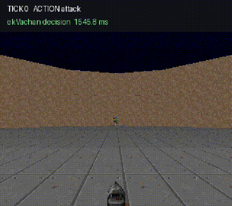
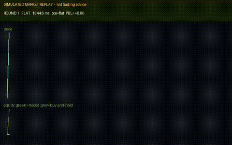
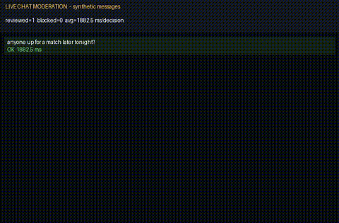
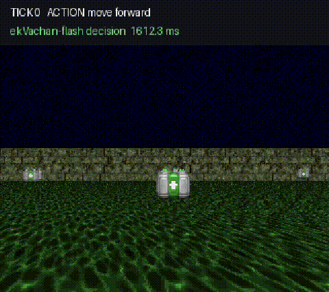

# ekVachan

**An open, self-hostable "System One" decision model — an API-compatible alternative to [TypeSafe AI's Jev](https://typesafe.ai/blog/introducing-system-one-models-and-jev), with real third-party benchmark numbers to back it.**

[](./LICENSE)
[](https://huggingface.co/abhi6168/ekvachan-decoder)
[](https://huggingface.co/abhi6168/ekvachan-decoder-flash)
[](https://huggingface.co/spaces/abhi6168/ekvachan)

## Demo

<p align="center">
  
  
  
  
</p>

Every clip shows real decisions from the real model — the action, verdict, and latency on screen are that run's measured numbers, not scripted theater. Full-length versions live in `demo/output/`.

Give it a `state` and a set of typed `questions` (`choice`, `score`, `noul`), and it returns calibrated probabilities in **one non-autoregressive forward pass** — no chain-of-thought, no text generation, no token-by-token decoding. Same shape of problem Jev solves, same request contract, but open-weight, self-hostable, and with every number below backed by a committed, re-runnable evidence file.

```bash
curl -s http://localhost:8000/v1/systemone \
  -H 'Content-Type: application/json' \
  -d '{
    "state": "The customer says the package never arrived.",
    "questions": {
      "resolution": {"type": "choice", "options": ["refund", "replace", "escalate"]}
    }
  }'
# -> {"results": {"resolution": {"choice": "refund", "probabilities": {...}, "confidence": 0.81}}, ...}
```

## Two models, one API

| | **ekVachan** | **ekVachan-flash** |
|---|---|---|
| Weights | [abhi6168/ekvachan-decoder](https://huggingface.co/abhi6168/ekvachan-decoder) | [abhi6168/ekvachan-decoder-flash](https://huggingface.co/abhi6168/ekvachan-decoder-flash) |
| Base | Qwen3.5-4B + LoRA | Qwen3.5-0.8B + LoRA |
| JevBench (231/231) | **70.99%** | **56.71%** |
| jabr-v2 (944/944) | **85.49%** | **67.37%** |
| Typical latency (p50, real request shapes) | ~112ms | **~24ms** |
| Best for | Maximum accuracy | Real-time: robotics, live moderation, high-throughput serving |

Flash runs the identical mechanism and API at **5× the typical speed** — the fastest open System-One-style decision model we're aware of. Embodied runs hold up too: 10-kill ViZDoom arena combat at ~92ms per decision, full-episode survival on navigation.

**vs. the field** — third-party numbers below are external, fetched from the respective projects' own READMEs, not run by us:

| Benchmark | ekVachan | ekVachan-flash | Von | Jev |
|---|---|---|---|---|
| JevBench accuracy | **70.99%** | 56.71% | 59.3%¹ | — |
| jabr-v2 accuracy | **85.49%** | 67.37% | 72.0% (macro, v1.1) | 96.6% (macro) |
| Typical latency (p50) | ~112ms | **~24ms** | <18ms | ~16ms |

¹ Von 1.2's README reports per-difficulty-tier only (easy 100.0%/48, standard 63.9%/72, hard 38.7%/111 — no published overall figure); 59.3% is a case-count-weighted aggregate derived from those tiers, not Von's own claim.

Latency is measured end-to-end on real JevBench-shaped requests through the production serving class with CUDA graphs on. Every number above is backed by a manifest in `results/` you can re-run yourself.

## Architecture, in short

- **Restricted-logit read** — build a prompt with a short code table (A, B, C, ...), take the last token's logits, restrict to just the relevant codes, softmax. One forward pass, no generation. Beat a from-scratch encoder classifier decisively (92.25% vs 86.32%) on **20x less training data**.
- **Wide-option support** — up to **588 options** in one request via a measured single-token code table — no architecture change needed to go past the naive 26-letter ceiling.
- **Multi-adapter routing** — one base model, hot-swapped named LoRA adapters (text vs. vision-capable), each validated against its own manifest's option-count cap.
- **Multimodal** — image-bearing requests route to the vision-capable adapter automatically; the read works unchanged whether the forward pass came from text or a vision-language model.
- **CUDA graphs, on by default** — manual capture/replay of the forward pass, fail-closed on any error. Accuracy-neutral, large latency win.

## Quickstart

```bash
git clone https://github.com/asp616848/better-jev-for-all && cd better-jev-for-all
uv sync   # or: pip install -e .

# Full-size model (default) — weights live in ./checkpoints:
EKVACHAN_TEXT_ADAPTER=vision uv run uvicorn serve.server:app --port 8000

# Flash model — same server, flash weights in the same slot layout:
git clone https://huggingface.co/abhi6168/ekvachan-decoder-flash /tmp/ekvachan-flash
ln -sfn /tmp/ekvachan-flash checkpoints
EKVACHAN_TEXT_ADAPTER=vision uv run uvicorn serve.server:app --port 8000
```

Then `POST /v1/systemone` with the same request shape as the curl example above. `Question.type` can be `choice` (2–588 options), `score` (ordinal levels), or `noul` (yes/no, returns a bare probability). See `sdk/` for Python and TypeScript clients.

Or skip setup entirely and try it in the [live Space](https://huggingface.co/spaces/abhi6168/ekvachan).

## Honest gaps

- **Response-shape verification**: request shape follows Jev's documented contract; response shape is a best-effort reconstruction — there's no live Jev API to diff against byte-for-byte.
- **`score`/`noul` accuracy** runs weaker than `choice` — errors are overwhelmingly adjacent-level confusions at class boundaries, but it's the known weak point in the primitive set.

`STATUS.md` is the living checklist of what's done and what's next. `PRD.md` holds every measured number and how it was produced.

## Repo layout

```
PRD.md                  — full design doc (everything above is the short version)
STATUS.md               — living task list: what's done, what's broken, what's next
training/               — data pipeline + training arms (encoder, decoder-LoRA, multischema variants)
eval/                   — shared accuracy/Brier/ECE metrics used by every training arm
serve/                  — Python reference inference + the /v1/systemone FastAPI server
benchmarks/             — real vendored third-party harnesses (jevbench/, jabr_v2/) + shared backends
results/                — committed evidence bundles (manifest per run)
sdk/                    — Python and TypeScript clients for /v1/systemone
hf_model/, hf_space/    — Hugging Face model card + demo Space sources
docs/                   — research notes, benchmark write-ups, demo assets (docs/demos/)
```

`checkpoints/` and `data/` are gitignored — trained weights live on Hugging Face and the training server, not in this repo.

## License

Apache-2.0 (code and model weights).
